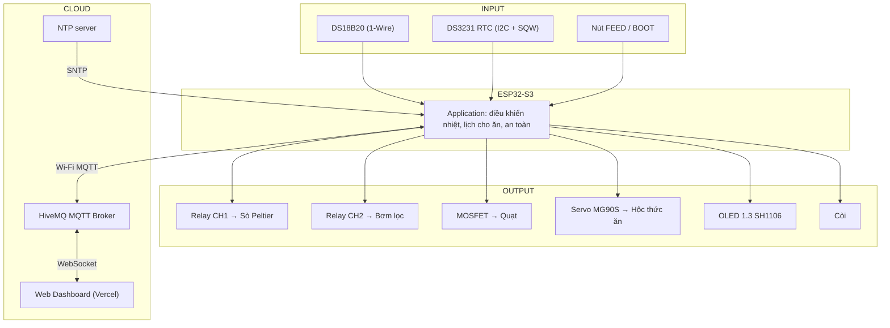
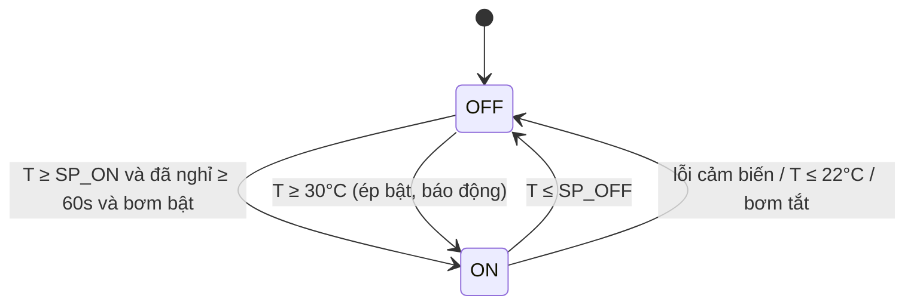
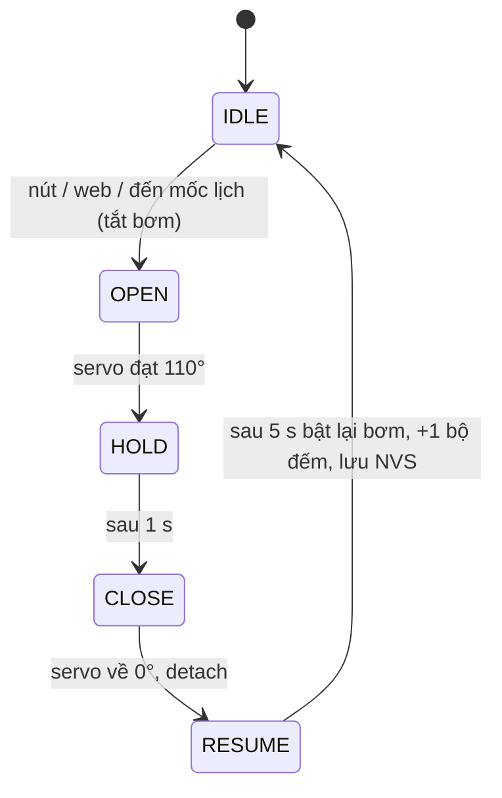

# 02 – ĐẶC TẢ HỆ THỐNG: BỂ CÁ THÔNG MINH IoT (SMART AQUARIUM)

| Mục | Nội dung |
|---|---|
| Môn học | Embedded System Design – GVHD: Huỳnh Hoàng Hà – HCMUTE |
| Phiên bản tài liệu | v2.0 (cập nhật Tuần 6 – System Integration) |
| Phần cứng | ESP32-S3 DevKitC-1 · DS18B20 · DS3231 RTC · OLED 1.3" SH1106 · Relay 2 kênh · TEC1-12706 · MG90S |
| Phần mềm | Firmware Arduino C++ (FW 2.0.0) · Web Dashboard (HTML/Tailwind/MQTT.js/Chart.js) trên Vercel |
| Truyền thông | MQTT qua HiveMQ public broker (TCP 1883 cho thiết bị, WSS 8884 cho web) |

---

## 1. Bài toán & mục tiêu

Bể cá mini ~4.5 L (20×14×16 cm) có thể tích nước nhỏ nên **nhiệt độ thay đổi rất nhanh** theo nhiệt độ phòng (mùa nóng tại TP.HCM phòng có thể 32–35°C), trong khi đa số cá cảnh nhiệt đới sống tốt ở **24–28°C**. Người nuôi còn thường xuyên **quên cho cá ăn** hoặc cho ăn quá nhiều khi vắng nhà.

Hệ thống cần:
1. Giữ nhiệt độ nước trong dải an toàn một cách tự động.
2. Cho cá ăn tự động theo **giờ cố định**, kể cả khi mất Internet hoặc sau khi mất điện.
3. Cho phép theo dõi và điều khiển tại chỗ (màn hình, nút) và từ xa (web).
4. Cảnh báo khi có sự cố (quá nóng, quá lạnh, hỏng cảm biến, mất giờ).

## 2. Phạm vi

| Trong phạm vi | Ngoài phạm vi (hướng phát triển) |
|---|---|
| Làm **mát** bằng sò Peltier + water block | Sưởi nước (cần thêm heater) |
| Đo nhiệt độ nước 1 điểm | Đo pH, TDS, oxy hòa tan, mực nước |
| Cho ăn thức ăn dạng hạt khô bằng hộc xoay | Định lượng thức ăn theo gram |
| Điều khiển qua MQTT broker công cộng | Xác thực người dùng, TLS phía thiết bị, broker riêng |
| Lưu cấu hình/bộ đếm trên NVS của ESP32 | Cơ sở dữ liệu lịch sử dài hạn + phân tích AI (tùy chọn giai đoạn sau) |

---

## 3. Phân tích yêu cầu (Requirement Analysis – W1)

| Vấn đề / Use case | Nhu cầu người dùng | Câu hỏi phân tích | Giải pháp đề xuất |
|---|---|---|---|
| Nước nóng lên theo phòng | Nhiệt độ luôn an toàn cho cá | Làm mát bằng gì? Khi nào bật/tắt? | Cảm biến nhiệt chống nước + sò Peltier + điều khiển trễ (hysteresis) |
| Quên cho cá ăn | Cá được ăn đúng giờ | Mất mạng / mất điện thì sao? | Servo hộc xoay + **RTC có pin** + lịch lưu trong bộ nhớ |
| Cho ăn quá nhiều | Tránh bẩn nước, cá bệnh | Giới hạn thế nào? | Khoảng cách tối thiểu giữa 2 lần + giới hạn số lần/ngày |
| Thức ăn bị bơm hút | Thức ăn không bị lọc mất | Khi nào tắt bơm? | Tạm dừng bơm trong lúc cho ăn |
| Muốn xem tình trạng tại bể | Biết nhanh nhiệt độ, trạng thái | Hiển thị gì? | Màn hình OLED |
| Vắng nhà | Xem & điều khiển từ xa | Qua kênh nào? | Wi-Fi + MQTT + Web dashboard |
| Thiết bị hỏng âm thầm | Được báo sự cố | Phát hiện thế nào? | Kiểm tra giá trị cảm biến, còi, cảnh báo web |
| Bảo trì, lắp ráp | Kiểm tra nhanh phần cứng | Làm sao test không cần code? | Chế độ Self-Test bằng nút / web |

---

## 4. Yêu cầu chức năng (Functional Requirements – W2)

| ID | Yêu cầu | Đặc tả (hệ thống PHẢI…) | Kiểm chứng | TC |
|---|---|---|---|---|
| FR01 | Đo nhiệt độ | Đo nhiệt độ nước chu kỳ **1 s**, độ phân giải 0.125°C, sai số ≤ ±0.5°C | So sánh nhiệt kế chuẩn tại 3 điểm (≈20, 26, 32°C) | TC01 |
| FR02 | Làm mát tự động | Ở chế độ AUTO: bật sò khi T ≥ **SP_ON (27.0°C)**, tắt khi T ≤ **SP_OFF (25.5°C)** | Ngâm cảm biến nước ấm/mát, quan sát relay | TC02 |
| FR03 | Bảo vệ relay | Không bật lại sò trong **60 s** kể từ lần tắt gần nhất | Dao động T quanh ngưỡng, đo khoảng thời gian | TC03 |
| FR04 | Quạt tản nhiệt | Quạt chạy khi sò chạy và **thêm 60 s** sau khi sò tắt | Quan sát quạt sau khi tắt sò | TC04 |
| FR05 | Chế độ vận hành | Hỗ trợ **AUTO / MANUAL**; MANUAL tự trở về AUTO sau **30 phút** | Bật tay từ web, chờ hết hạn | TC05 |
| FR06 | Cho ăn thủ công | Cho ăn khi nhấn nút FEED hoặc lệnh web; servo 0°→110°→0° | Nhấn nút, quan sát hộc | TC06 |
| FR07 | Cho ăn theo lịch | Cho ăn tại tối đa **4 mốc giờ/ngày** theo giờ RTC, **không cần Internet** | Đặt lịch, ngắt Wi-Fi | TC07 |
| FR08 | Giữ thời gian | Giữ giờ khi mất điện nhờ DS3231 + pin; đồng bộ NTP khi có mạng; cho phép đặt giờ từ web | Rút điện 10 phút, bật lại không mạng | TC08 |
| FR09 | Chống cho ăn sai | Không cho ăn lặp sau reset; bỏ mốc nếu vừa cho ăn < 30 phút; tối đa **6 lần/ngày**; cho ăn bù nếu trễ ≤ 30 phút | Reset / bấm liên tục | TC09 |
| FR10 | Tạm dừng bơm | Tắt bơm khi bắt đầu cho ăn, bật lại **5 s** sau khi hộc đóng | Quan sát relay bơm | TC10 |
| FR11 | Hiển thị tại chỗ | OLED hiển thị: giờ, Wi-Fi/MQTT/RTC, nhiệt độ, chế độ, sò, bơm, quạt, lần ăn kế tiếp, số lần ăn, cảnh báo; làm mới 0.5 s | Quan sát | TC11 |
| FR12 | Giám sát từ xa | Gửi telemetry JSON mỗi **2 s**; dashboard hiển thị & vẽ biểu đồ | Mở web, so với OLED | TC12 |
| FR13 | Điều khiển từ xa | Nhận lệnh: sò, bơm, chế độ, cho ăn, self-test, lịch, ngưỡng, giờ, tắt còi | Gửi từng lệnh | TC13 |
| FR14 | Cảnh báo & an toàn | Lỗi cảm biến → tắt sò + còi; T ≥ 30°C → ép bật sò + còi; T ≤ 22°C → ép tắt sò + còi; bơm tắt → khóa sò | Rút DS18B20, ngâm nước nóng/lạnh | TC14 |
| FR15 | Self-Test | Kiểm tra còi, 2 relay, quạt, servo, DS18B20, RTC; báo PASS/FAIL trên OLED + web | Giữ BOOT 2 s | TC15 |
| FR16 | Lưu cấu hình | Lịch, ngưỡng, bộ đếm lưu NVS, không mất khi mất điện | Đổi lịch, rút điện | TC16 |

## 5. Yêu cầu phi chức năng (NFR)

| ID | Loại | Đặc tả |
|---|---|---|
| NFR01 | Thời gian đáp ứng | Lệnh web → cơ cấu chấp hành ≤ **1 s** (mạng ổn định) |
| NFR02 | Non-blocking | Vòng `loop()` không chặn quá 50 ms khi vận hành bình thường (trừ Self-Test) |
| NFR03 | Độ chính xác giờ | Lệch ≤ ±2 ppm (≈ ±1 phút/năm) khi offline nhờ DS3231 TCXO |
| NFR04 | Tin cậy | Tự kết nối lại Wi-Fi (30 s) & MQTT (5 s); không reset khi servo chạy |
| NFR05 | An toàn điện | Mọi chân tín hiệu ESP32 ≤ 3.3 V; có cầu chì; tải 12V dùng tiếp điểm NO |
| NFR06 | Nguồn | Toàn hệ chạy từ 1 adapter 12V-10A |
| NFR07 | Bảo trì | Module cắm bằng connector, có Self-Test, tài liệu README cho từng thư mục |
| NFR08 | Bảo mật (mức môn học) | Topic MQTT riêng theo nhóm; LWT báo online/offline |

---

## 6. Kiến trúc hệ thống (W3)

### 6.1 Sơ đồ khối tổng thể



### 6.2 Kiến trúc phần mềm firmware (phân lớp)

```text
┌───────────────────────────────────────────────────────────────┐
│ APPLICATION : controlTemperature() · checkSchedule() ·        │
│               handleAlarm() · mqttCallback() · runSelfTest()  │
├───────────────────────────────────────────────────────────────┤
│ SERVICES    : Time service (RTC⇄System⇄NTP) · Feed FSM ·      │
│               Buzzer FSM · Telemetry/Event · NVS settings     │
├───────────────────────────────────────────────────────────────┤
│ DRIVERS/LIB : DallasTemperature · RTClib · Adafruit_SH110X ·  │
│               ESP32Servo · PubSubClient · ArduinoJson         │
├───────────────────────────────────────────────────────────────┤
│ HAL (Arduino-ESP32 / ESP-IDF): GPIO · I2C · LEDC PWM · Wi-Fi ·│
│               SNTP · NVS · Interrupt                          │
├───────────────────────────────────────────────────────────────┤
│ HARDWARE    : ESP32-S3 + ngoại vi                             │
└───────────────────────────────────────────────────────────────┘
```

### 6.3 Phân chia HW/SW

| Chức năng | Phần cứng | Phần mềm |
|---|---|---|
| Đo nhiệt | DS18B20 + trở kéo | Đọc bất đồng bộ, lọc giá trị lỗi (−127, 85, ngoài 0–50°C) |
| Làm mát | Relay CH1, sò, water block, quạt, MOSFET | Hysteresis, thời gian nghỉ tối thiểu, quạt chạy trễ |
| Cho ăn | Servo MG90S, hộc xoay, tụ đệm | FSM quét góc, lịch RTC, chống cho ăn lặp |
| Thời gian | DS3231 (TCXO) + CR2032 | Đồng bộ NTP ⇄ RTC, múi giờ UTC+7, nhịp 1 Hz qua ngắt |
| HMI | OLED, còi, 2 nút | Giao diện OLED, mẫu tiếng còi, debounce nút |
| Kết nối | Wi-Fi ESP32-S3 | MQTT, JSON, tự kết nối lại, LWT |

### 6.4 Danh sách giao tiếp (Interface list)

| Giao tiếp | Thiết bị | Thông số |
|---|---|---|
| 1-Wire | DS18B20 | GPIO4, 11-bit (375 ms/lần chuyển đổi) |
| I2C | OLED SH1106 (0x3C), DS3231 (0x68), AT24C32 (0x57) | GPIO8 SDA / GPIO9 SCL, 400 kHz, 3V3 |
| GPIO ngắt | DS3231 SQW | GPIO7, FALLING, 1 Hz |
| GPIO ra | Relay CH1/CH2 (Active-LOW), MOSFET quạt, còi | GPIO19, GPIO18, GPIO15 (tùy chọn), GPIO12 |
| PWM | Servo | GPIO13, 50 Hz, 500–2400 µs |
| GPIO vào | Nút BOOT / FEED | GPIO0 / GPIO16, INPUT_PULLUP |
| Wi-Fi/MQTT | HiveMQ | `broker.hivemq.com:1883` (thiết bị), `wss://…:8884/mqtt` (web) |

### 6.5 Giao thức MQTT

`TOPIC_BASE = smartaquarium_node2026`

| Topic | Hướng | QoS/Retain | Nội dung |
|---|---|---|---|
| `…/telemetry` | ESP32 → Web | 0 / không | JSON trạng thái mỗi 2 s |
| `…/command` | Web → ESP32 | 0 / không | JSON lệnh |
| `…/status` | ESP32 → Web | 1 / **retain** | `online` / `offline` (LWT) |
| `…/event` | ESP32 → Web | 0 / không | Sự kiện: feed, alarm, time_sync, self_test… |

**Telemetry mẫu**
```json
{"temp":26.1,"chiller":false,"pump":true,"fan":false,"mode":"AUTO",
 "feed_today":1,"feed_count":12,"feeding":false,"time":"2026-09-17 10:21:05",
 "time_src":"NTP","rtc_ok":true,"rtc_temp":28.5,"next_feed":"17:30",
 "schedule":"07:00,17:30","sp_on":27,"sp_off":25.5,"alarm":"NONE",
 "rssi":-61,"uptime":3605,"fw":"2.0.0"}
```

**Lệnh**

| `device` | Tham số | Tác dụng |
|---|---|---|
| `chiller` | `action: ON/OFF` | Bật/tắt sò, chuyển MANUAL 30 phút |
| `pump` | `action: ON/OFF` | Bật/tắt bơm (tắt bơm ⇒ khóa sò) |
| `mode` | `action: AUTO/MANUAL` | Đổi chế độ |
| `feed` | – | Cho ăn ngay |
| `test` | – | Self-Test |
| `schedule` | `slots: "07:00,17:30"` | Đặt lịch (chuỗi rỗng = tắt) |
| `setpoint` | `on: 27.0, off: 25.5` | Đổi ngưỡng (off ≤ on − 0.5) |
| `time` | `epoch: 1789627265` | Đặt giờ từ trình duyệt → RTC |
| `alarm` | `action: MUTE` | Tắt còi cảnh báo hiện tại |

---

## 7. Hành vi hệ thống (State machine)

### 7.1 Điều khiển nhiệt độ



### 7.2 Cho ăn



### 7.3 Nguồn thời gian

```text
Khởi động ─► DS3231 còn giờ? ─ có ─► giờ hệ thống = RTC (src=RTC)
                    │ không
                    ▼
            chờ NTP / lệnh web ─► (TIME_INVALID: tạm dừng lịch)
NTP đồng bộ ─► giờ hệ thống = NTP ─► ghi vào RTC (lần đầu + mỗi 6 giờ)
Mất Wi-Fi   ─► mỗi 10 phút nạp lại giờ hệ thống từ RTC (TCXO chính xác hơn thạch anh ESP32)
```

---

## 8. Ma trận truy vết (Traceability)

| Requirement | Chức năng firmware | Test case |
|---|---|---|
| FR01 | `updateSensor()` | TC01 |
| FR02, FR03, FR04 | `controlTemperature()`, `setChiller()`, `applyOutputs()` | TC02–TC04 |
| FR05 | `controlTemperature()` (MANUAL_TIMEOUT_MS) | TC05 |
| FR06, FR10 | `startFeeding()`, `updateFeeding()` | TC06, TC10 |
| FR07, FR09 | `checkSchedule()` | TC07, TC09, TC-RTC-04..07 |
| FR08 | `initTime()`, `handleTimeSync()`, lệnh `time` | TC08, TC-RTC-01..03, 08..10 |
| FR11 | `renderOLED()` | TC11 |
| FR12, FR13 | `sendTelemetry()`, `mqttCallback()` | TC12, TC13 |
| FR14 | `controlTemperature()`, `handleAlarm()` | TC14 |
| FR15 | `runSelfTest()` | TC15 |
| FR16 | `loadSettings()`, `saveFeedCounters()` | TC16 |

## 9. Ràng buộc & giả định

- Bể 4.5 L, phòng ≤ 35°C; sò 60 W đủ hạ vài °C cho thể tích này khi mặt nóng được tản nhiệt tốt (cần đo thực tế ở W7).
- Thức ăn dạng hạt khô, không vón cục.
- Wi-Fi 2.4 GHz; broker HiveMQ công cộng chỉ phục vụ học tập.
- Chi tiết mạch điện, bảng nối chân và quy trình lắp: xem **`docs/04_PHAN_CUNG_REV2_RTC.md`**.
