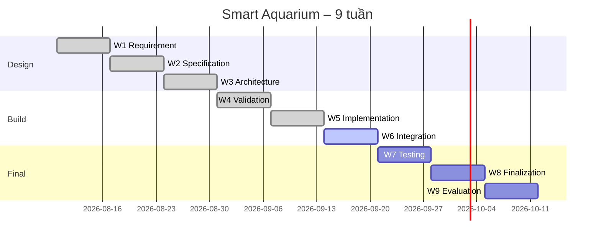

# 03 – LỘ TRÌNH · TIẾN ĐỘ · PHÂN CÔNG NHIỆM VỤ

> Cập nhật: 17/09/2026 (W6). **Điền tên / MSSV / SĐT thật của thành viên** vào bảng dưới (thầy yêu cầu nộp kèm danh sách).

## 1. Thành viên & vai trò

| Mã | Họ tên | MSSV | SĐT | Vai trò chính |
|---|---|---|---|---|
| TV1 | Rel | … | … | **Hardware lead**: toàn bộ mạch, nguồn, PCB, tích hợp RTC DS3231 |
| TV2 | … | … | … | Firmware: driver, logic điều khiển, test đơn vị |
| TV3 | … | … | … | Web dashboard, MQTT, deploy Vercel |
| TV4 | … | … | … | Tài liệu, report, test case, slide; đại diện nộp UTEXLMS |

*(Nhóm 3 người: gộp TV3 + TV4.)*

---

## 2. Lộ trình 9 tuần

| Tuần | Thời gian (dự kiến) | Giai đoạn | Output | Phụ trách chính | Tiến độ |
|---|---|---|---|---|---|
| W1 | 10/08 – 16/08 | Requirement Analysis | Bảng phân tích yêu cầu | Cả nhóm | ✅ 100% |
| W2 | 17/08 – 23/08 | System Specification | Đặc tả FR/NFR | TV4 | ✅ 100% |
| W3 | 24/08 – 30/08 | Architecture & HW/SW | Sơ đồ khối, pinout, BOM | TV1, TV2 | ✅ 100% (sửa ở W6) |
| W4 | 31/08 – 06/09 | Prototype Validation | Kết quả test module | TV1, TV2 | ✅ 90% (RTC dời sang W6) |
| W5 | 07/09 – 13/09 | Implementation | FW v1, Web v1 | TV2, TV3 | ✅ 100% |
| **W6** | **14/09 – 20/09** | **System Integration** | **Mạch Rev2 + RTC, FW v2, Web v2, Report Ch.1–2** | **TV1 (mạch), cả nhóm** | 🔄 **~60%** |
| W7 | 21/09 – 27/09 | Testing & Optimization | Bảng test case PASS/FAIL, bản sửa lỗi | TV4, TV2 | ⏳ |
| W8 | 28/09 – 04/10 | Finalization | Prototype hoàn chỉnh, Report đủ chương, Slide | Cả nhóm | ⏳ |
| W9 | 05/10 – 11/10 | Evaluation | Demo + bảo vệ | Cả nhóm | ⏳ |

---

## 3. Bảng công việc chi tiết Tuần 6

| ID | Công việc | Người làm | Deadline | Phụ thuộc | Trạng thái | Output |
|---|---|---|---|---|---|---|
| W6-01 | Rà soát mạch Rev1, liệt kê lỗi | **Rel** | 15/09 | – | ✅ | `docs/04` §1 |
| W6-02 | Thiết kế Rev2: pinout, nguồn, driver | **Rel** | 16/09 | W6-01 | ✅ | `docs/04` §3–5 |
| W6-03 | Cập nhật BOM v1.1, đặt mua linh kiện thiếu | **Rel** | 16/09 | W6-02 | ✅ BOM · 🔄 chờ hàng | xlsx v1.1 |
| W6-04 | Hàn khối nguồn + test B1–B3 | **Rel** | 18/09 | W6-03 | 🔄 | Ảnh đo áp |
| W6-05 | Hàn bus I2C + gắn DS3231, OLED; test B4 | **Rel** | 18/09 | W6-04 | 🔄 | Ảnh I2C scanner |
| W6-06 | Hàn relay (JD-VCC), MOSFET quạt, servo, còi, nút; test B5–B9 | **Rel** | 19/09 | W6-05 | ⏳ | Video test |
| W6-07 | FW v2: RTC/NTP, lịch, non-blocking, an toàn | Rel + TV2 | 17/09 | – | ✅ | `.ino` v2.0.0 |
| W6-08 | Nạp FW v2 lên mạch Rev2, Self-Test | TV2 + Rel | 19/09 | W6-06, W6-07 | ⏳ | Ảnh OLED PASS |
| W6-09 | Web v2 + deploy Vercel, khớp TOPIC_BASE | TV3 | 18/09 | W6-07 | 🔄 | Link Vercel |
| W6-10 | Test 3 use case end-to-end + TC-RTC-01..04 | Cả nhóm | 20/09 | W6-08, W6-09 | ⏳ | Video demo |
| W6-11 | Đặc tả v2.0 | TV4 + Rel | 17/09 | – | ✅ | `docs/02` |
| W6-12 | Report Chương 1, 2 | TV4 | 17/09 | W6-11 | ✅ | `.docx` |
| W6-13 | Push GitHub + nộp UTEXLMS | TV4 | 20/09 | tất cả | ⏳ | Link commit |

## 4. Kế hoạch W7 – W9

| Tuần | Công việc | Người làm |
|---|---|---|
| W7 | Chạy toàn bộ TC01–TC16 + TC-RTC-01..10, ghi PASS/FAIL, số lần lặp | TV4 (chủ trì), TV2 |
| W7 | Đo năng lực làm lạnh: log nhiệt độ 2 giờ khi phòng nóng, thời gian hạ 1°C | Rel |
| W7 | Đo dòng tổng, nhiệt độ LM2596/MOSFET sau 1 giờ chạy | Rel |
| W7 | Tối ưu: RAM/Flash, thời gian loop, độ ổn định MQTT 24 h | TV2, TV3 |
| W8 | Đóng hộp/cố định mạch, đi dây gọn, dán nhãn connector | Rel |
| W8 | Report Chương 3 (Thiết kế), 4 (Kết quả), 5 (Kết luận), User guide | TV4 + cả nhóm |
| W8 | Slide + video demo 3 phút | TV3, TV4 |
| W9 | Demo, trả lời câu hỏi thiết kế (Why/What/How/Evidence) | Cả nhóm |

## 5. Rủi ro & phương án

| Rủi ro | Mức | Phương án |
|---|---|---|
| Linh kiện bổ sung giao trễ | Cao | Mua tại cửa hàng trực tiếp; tạm test bằng nguồn 12V-5A **không nối sò** |
| Sò không đủ công suất hạ nhiệt bể | Trung bình | Cách nhiệt thành bể, tăng lưu lượng nước, dùng tản nhiệt lớn hơn; ghi nhận giới hạn trong report |
| Hở nước gần mạch điện | Cao | Mạch đặt cao hơn mặt nước, hộp nhựa, ống silicone siết cổ dê |
| Broker công cộng mất kết nối | Thấp | Hệ thống vẫn tự động hoàn toàn nhờ RTC + logic cục bộ |
| Mạch hàn lỗi khó dò | Trung bình | Hàn theo khối, test B1–B10 từng bước, dùng connector |

---

## 6. Quản lý công việc cá nhân – Rel (TV1)

> Giờ làm và kết quả dưới đây là **bản nháp – Rel sửa lại theo thực tế**. Mẫu này dùng cho file "Quản lý công việc cá nhân" cuối kỳ. Mỗi thành viên copy thành file riêng.

| Ngày | Tuần | Công việc | Thời gian | Kết quả / minh chứng | Vấn đề gặp phải |
|---|---|---|---|---|---|
| 15/09 | W6 | Rà soát mạch Rev1, đối chiếu BOM – code – tài liệu | 3 h | 13 lỗi/cải tiến (`docs/04` §1) | Phát hiện nguồn 5A không đủ, GPIO19 trùng USB |
| 16/09 | W6 | Thiết kế Rev2 + ngân sách công suất + BOM v1.1 | 3 h | `docs/04` §3–5, xlsx v1.1 | Thiếu relay & bơm trong BOM |
| 17/09 | W6 | FW v2 phần RTC/NTP, lịch cho ăn; test case RTC | 4 h | `.ino` v2.0.0, `docs/04` §8 | – |
| 18/09 | W6 | Hàn nguồn + I2C, test B1–B5 | … | … | … |
| 19/09 | W6 | Hàn khối công suất, test B6–B10 | … | … | … |

**Tổng kết đóng góp W6 (tự đánh giá):** thiết kế lại toàn bộ mạch, tích hợp RTC, đồng tác giả firmware v2.
