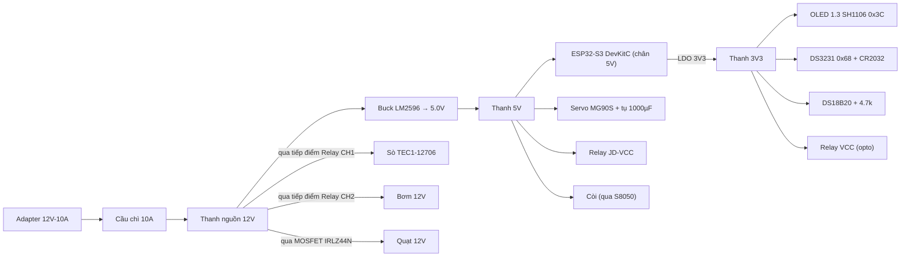

# 04 – PHẦN CỨNG REV2: LÀM LẠI TOÀN BỘ MẠCH + TÍCH HỢP RTC DS3231

> **Người phụ trách:** Rel (TV1 – Hardware) · **Tuần:** W6 – System Integration
> **Mục tiêu:** Hoàn thiện toàn bộ mạch trên PCB đục lỗ, sửa các lỗi thiết kế của Rev1 và thêm module thời gian thực DS3231 (đã có trong danh sách mua sắm) để lịch cho cá ăn chạy đúng giờ kể cả khi mất Wi-Fi / mất điện.
> **Firmware đi kèm:** `firmware/smart_aquarium_esp32s3/smart_aquarium_esp32s3.ino` (v2.0.0)

---

## 1. Kết quả rà soát Rev1 – cần LÀM LẠI những gì?

Mức độ: 🔴 bắt buộc sửa (có thể hỏng linh kiện / sai chức năng) · 🟠 nên sửa (không ổn định) · 🟢 cải tiến

| # | Mức | Vấn đề ở Rev1 | Hậu quả | Cách làm lại ở Rev2 |
|---|---|---|---|---|
| H1 | 🔴 | Trở kéo DS18B20 **lên 5V** (README + bảng nối chân) | Chân GPIO ESP32-S3 **không chịu 5V** → hỏng dần GPIO4 | Cấp DS18B20 bằng **3V3**, trở 4.7 kΩ nối DQ ↔ **3V3** |
| H2 | 🟢 | Relay Chiller ở **GPIO19** (trùng USB D−) | Mạch cũ đã chạy ổn | **Giữ nguyên GPIO19/GPIO18**; chỉ lưu ý nạp code qua cổng **UART/COM** của DevKit |
| H3 | 🔴 | Nguồn **12V–5A** cho cả hệ | TEC1-12706 tự ăn ~5–6 A @12V + quạt + bơm + buck 5V ≈ **7 A** → adapter quá tải, sụt áp, nóng | Đổi nguồn **12V – 10A** (120 W) + cầu chì 10 A đầu vào |
| H4 | 🟢 | Relay module 5V kích bằng GPIO 3.3V | Relay đang chạy ổn → **giữ nguyên cách nối cũ** | Chỉ khi đèn IN không tắt hẳn: tháo jumper JD-VCC (`VCC=3V3`, `JD-VCC=5V`) |
| H5 | 🔴 | OLED & DS3231 cấp 5V | Module có sẵn trở kéo I2C lên VCC → SDA/SCL bị kéo lên **5V** vào ESP32 | Cấp **OLED + DS3231 = 3V3** (cả hai chạy tốt 3.3V) |
| H6 | 🟢 | Còi nối thẳng GPIO12 | Còi hơi nhỏ | **Giữ GPIO12**; muốn to hơn thì thêm transistor S8050 (tùy chọn) |
| H7 | 🟠 | Quạt chung relay với sò | Tắt sò là tắt quạt ngay → nhiệt mặt nóng dội ngược sang mặt lạnh | Quạt tách riêng qua **MOSFET IRLZ44N** (đã có trong BOM) + chạy trễ 60 s |
| H8 | 🟠 | Servo không có tụ đệm | Dòng khởi động servo kéo tụt 5V → `BROWNOUT_RST` | Tụ **1000 µF/16V + 100 nF** sát jack servo |
| H9 | 🟠 | Không có cầu chì, dây lực đi trên PCB đục lỗ | Đường đồng lỗ chịu dòng kém → cháy mạch khi dòng 6 A | Dây Peltier **≥ 1 mm² (18 AWG)** đi thẳng qua **domino KF301**, không đi trên đường lỗ |
| H10 | 🟠 | Driver OLED: code dùng SSD1306 nhưng OLED 1.3" gần như luôn là **SH1106** | Lệch 2 cột, nhiễu mép màn | Firmware v2 dùng `Adafruit_SH110X` (có `#define` chuyển lại SSD1306) |
| H11 | 🟠 | BOM ≠ thiết kế: BOM ghi **TFT ST7789 SPI**, thiếu **relay 2 kênh** và **máy bơm 12V** | Mua sai / thiếu linh kiện | Cập nhật `hardware/danh_sach_mua_sam_v1.1.xlsx` |
| H12 | 🟢 | Chưa có thời gian thực | Lịch cho ăn phụ thuộc Internet; mất điện là mất giờ | **Thêm RTC DS3231** trên bus I2C chung + chân SQW ngắt 1 Hz |
| H13 | 🟢 | Chỉ có nút BOOT | Không cho ăn tại chỗ được | Thêm **nút FEED** GPIO16 |

---

## 2. Sơ đồ khối phần cứng Rev2



---

## 3. Bảng nối chân Rev2 (so với Rev1)

| Chức năng | Rev1 | **Rev2** | Ghi chú điện |
|---|---|---|---|
| DS18B20 DQ | GPIO4 | **GPIO4** | VDD = **3V3**, trở 4.7 kΩ DQ↔3V3 |
| I2C SDA (OLED + RTC) | GPIO8 | **GPIO8** | Bus chung, OLED 0x3C, DS3231 0x68, EEPROM AT24C32 0x57 |
| I2C SCL | GPIO9 | **GPIO9** | Tốc độ 400 kHz, dây ≤ 20 cm |
| **DS3231 SQW/INT** | – | **GPIO7** | INPUT_PULLUP, xung 1 Hz → ngắt FALLING |
| Relay CH1 – Sò Peltier | GPIO19 | **GPIO19 (giữ nguyên)** | Active-LOW |
| Relay CH2 – Bơm | GPIO18 | **GPIO18 (giữ nguyên)** | Active-LOW |
| **Quạt tản nhiệt** | chung relay | **GPIO15** | Gate IRLZ44N qua 100 Ω, kéo xuống 10 kΩ |
| Servo MG90S | GPIO13 | **GPIO13** | PWM 50 Hz, 500–2400 µs |
| Còi | GPIO12 | **GPIO12 (giữ nguyên)** | Nối thẳng như cũ (S8050 tùy chọn) |
| Nút Self-Test | GPIO0 (BOOT) | **GPIO0** | Giữ 2 s |
| **Nút FEED** | – | **GPIO16** | Nút → GND, INPUT_PULLUP |

**Chân nên tránh khi thêm mới trên ESP32-S3 N8R8/N16R8:** GPIO20 (USB; GPIO19 đang dùng cho relay – nạp code qua cổng UART), GPIO26–32 (SPI Flash), GPIO33–37 (PSRAM Octal), GPIO3/45/46 (strapping), GPIO43/44 (UART0 – nạp code/Serial).

---

## 4. Chi tiết đấu nối từng khối

### 4.1 Khối nguồn

```text
Adapter 12V-10A (+) ──[Cầu chì 10A]──┬──────────────── 12V BUS (dây 1mm²)
                                      │
                                      ├── LM2596 IN+      LM2596 OUT+ ── 5V BUS
Adapter (−) ─────────────────────────┴── LM2596 IN−      LM2596 OUT− ── GND CHUNG (hình sao)
                         Tụ 470µF/25V trên 12V BUS    Tụ 470µF/10V trên 5V BUS
```

1. **Vặn biến trở LM2596 ra 5.0–5.1 V khi CHƯA cắm tải** (đo bằng đồng hồ).
2. GND nối **hình sao** tại một điểm gần buck: GND dòng lớn (sò, bơm, quạt) không đi chung đường với GND logic (ESP32, cảm biến).
3. ⚠️ Không cắm **cáp USB và 5V ngoài cùng lúc** nếu chưa có diode chống ngược. Khi nạp code: rút jack 5V ngoài **hoặc** thêm diode Schottky 1N5819/SS34 nối tiếp từ 5V BUS → chân 5V của DevKit.
4. LM2596 thực tế chỉ nên tải liên tục ~2 A. Tải 5V của hệ ≈ 1.3 A đỉnh → vẫn đạt. Nếu nóng: thay **XL4015 (5 A)**.

### 4.2 Relay 2 kênh (sò + bơm)

> Relay đang chạy ổn thì **giữ nguyên dây như mạch cũ** (IN1→GPIO19, IN2→GPIO18, VCC/GND như cũ). Cách tách JD-VCC dưới đây chỉ dùng khi đèn IN không tắt hẳn.

```text
Relay module:  [JD-VCC] [VCC]  ← THÁO JUMPER nối 2 chân này
               JD-VCC ─── 5V BUS    (nuôi cuộn relay)
               VCC    ─── 3V3       (nuôi LED opto, cùng mức với GPIO)
               GND    ─── GND chung
               IN1    ─── GPIO19    IN2 ─── GPIO18

Tiếp điểm CH1:  COM ── 12V BUS     NO ── (+) Sò TEC1-12706     (−) Sò ── GND 12V
Tiếp điểm CH2:  COM ── 12V BUS     NO ── (+) Bơm 12V           (−) Bơm ── GND 12V
```

- Dùng tiếp điểm **NO** (thường mở): mất điện/ESP32 treo → sò & bơm **tắt** (an toàn). Riêng bơm có thể chuyển sang **NC** nếu nhóm muốn "mất ESP32 vẫn lọc nước" → khi đó phải đảo logic `RELAY_ON/OFF` cho CH2 trong firmware.
- Firmware set mức OFF **trước** `pinMode(OUTPUT)` để relay không chớp khi khởi động.

### 4.3 Quạt tản nhiệt qua MOSFET IRLZ44N

```text
GPIO15 ──[100Ω]──┬── G (IRLZ44N)
                 └─[10kΩ]── GND
Quạt (+) ── 12V BUS          D ── Quạt (−)          S ── GND
Diode 1N5819: Anode → D (Quạt −), Cathode → 12V (song song ngược với quạt)
```

### 4.4 DS18B20 (chống nước, 3 dây)

```text
Đỏ  (VDD) ── 3V3
Đen (GND) ── GND
Vàng (DQ) ── GPIO4 ──[4.7kΩ]── 3V3      (+ tụ 100nF VDD–GND sát domino)
```

### 4.5 Bus I2C: OLED 1.3" SH1106 + RTC DS3231

```text
                3V3 ──┬───────────────┬───────────────
                      │               │
               OLED VCC         DS3231 VCC
GPIO8 (SDA) ──── OLED SDA ────── DS3231 SDA
GPIO9 (SCL) ──── OLED SCL ────── DS3231 SCL
GPIO7       ─────────────────── DS3231 SQW
GND ──────────── OLED GND ────── DS3231 GND
                                  DS3231 32K: bỏ trống
```

**Lưu ý riêng cho module DS3231 ZS-042 (loại phổ biến có EEPROM AT24C32):**
- Module có mạch "sạc pin" (điện trở 200 Ω + diode 1N4148) cho pin **LIR2032 sạc được**. Nếu dùng **CR2032 (không sạc)** như trong BOM → **gỡ điện trở 200 Ω hoặc diode** để tránh sạc vào pin (nguy cơ phồng pin). Cấp VCC 3.3V giúp giảm rủi ro nhưng vẫn nên gỡ.
- Hai module đều có trở kéo I2C → điện trở song song ≈ 2.35 kΩ, vẫn trong ngưỡng I2C 400 kHz.
- Địa chỉ không trùng: OLED 0x3C, DS3231 0x68, EEPROM 0x57.

### 4.6 Servo MG90S

```text
Nâu ── GND        Đỏ ── 5V BUS        Cam ── GPIO13
Tụ 1000µF/16V + 100nF song song ngay tại header servo
```

### 4.7 Còi active 5V + nút nhấn

```text
5V ── Còi(+)   Còi(−) ── C (S8050)   E ── GND   B ──[1kΩ]── GPIO12
GPIO16 ── Nút FEED ── GND           GPIO0 = nút BOOT có sẵn trên DevKit
```

---

## 5. Ngân sách công suất

| Tải | Điện áp | Dòng (điển hình / đỉnh) | Quy về 12V |
|---|---|---|---|
| Sò TEC1-12706 | 12 V | ~5.0 / 6.4 A | 6.4 A |
| Quạt tản nhiệt | 12 V | 0.2 / 0.3 A | 0.3 A |
| Bơm lọc mini | 12 V | 0.3 / 0.8 A | 0.8 A |
| ESP32-S3 (Wi-Fi TX) | 5 V | 0.1 / 0.35 A | |
| Servo MG90S | 5 V | 0.15 / 0.7 A | |
| Relay ×2 + OLED + RTC + còi | 5V/3V3 | ~0.2 A | |
| **Tổng nhánh 5V** | 5 V | **≈ 1.3 A đỉnh** | ≈ 0.65 A (η≈85%) |
| **TỔNG** | | | **≈ 8.2 A đỉnh** → chọn **12V – 10A** |

---

## 6. Bố trí trên PCB đục lỗ 7×9 cm (gợi ý)

```text
┌──────────────────────────── 90 mm ────────────────────────────┐
│ [KF301 12V IN] [FUSE]  │ VÙNG CÔNG SUẤT 12V                     │
│ [KF301 SÒ] [KF301 BƠM] │ (module relay đặt ngoài PCB, bắt vít)  │
│ [KF301 QUẠT] IRLZ44N+D │ Dây lực đi dây rời, không qua lỗ đồng  │
├────────────────────────┼────────────────────────────────────────┤
│ LM2596 (bắt trụ đồng)  │ VÙNG LOGIC 5V / 3V3                     │
│ tụ 470µF   S8050+còi   │ [Header cái ESP32-S3 DevKitC 2×22]      │
│ [Header SERVO + 1000µF]│ [JST OLED] [JST DS3231] [KF301 DS18B20] │
│ [Nút FEED]             │ 4.7k, 10k, 100Ω, 100nF                 │
└────────────────────────────────────────────────────────────────┘
```

- Hàn **header cái** cho ESP32 để tháo ra nạp/sửa được.
- Dùng connector (JST-XH / domino) cho mọi linh kiện ngoài: dễ tháo khi test từng module.
- Đi dây GND logic và GND công suất về chung **một điểm** gần buck.

---

## 7. Quy trình lắp & bring-up (làm theo thứ tự, test xong mới sang bước kế)

| Bước | Việc làm | Đo / kiểm tra | Đạt khi |
|---|---|---|---|
| B1 | Hàn khối nguồn (fuse, buck, tụ), **chưa gắn ESP32** | Đo 12V BUS, 5V BUS | 12.0±0.5 V · 5.0–5.1 V |
| B2 | Kiểm tra ngắn mạch | Đo trở 12V–GND, 5V–GND, 3V3–GND | > 1 kΩ |
| B3 | Gắn ESP32 (chưa ngoại vi), cấp 5V ngoài | Đo chân 3V3 | 3.3 V, board boot, Serial chạy |
| B4 | Nối I2C: OLED + DS3231 | Chạy I2C scanner | Thấy **0x3C, 0x57, 0x68** |
| B5 | Nối DS18B20 | Serial đọc nhiệt | Khác −127/85, sai lệch ≤0.5°C so với nhiệt kế |
| B6 | Nối relay (tháo JD-VCC), **chưa nối tải 12V** | Toggle GPIO19/18 | LED + tiếng "tách" đúng, OFF là **tắt hẳn** |
| B7 | Nối quạt qua MOSFET | GPIO15 HIGH/LOW | Quạt chạy/dừng, MOSFET không nóng |
| B8 | Nối servo + tụ | Chạy sweep 0→110→0 | Không reset (không `BROWNOUT_RST`) |
| B9 | Nối bơm + sò (tải thật) | Ampe kìm/đồng hồ trên 12V | Tổng dòng ≤ 8 A, adapter không sụt < 11.5 V |
| B10 | Nạp firmware v2, chạy Self-Test (giữ BOOT 2 s) | OLED + Web | 6 mục PASS |

---

## 8. Kiểm thử tích hợp RTC (test case cho W6–W7)

| TC | Mục tiêu | Cách làm | Kỳ vọng |
|---|---|---|---|
| TC-RTC-01 | Nhận diện RTC | Khởi động, xem OLED góc phải | Hiển thị `R+` |
| TC-RTC-02 | Đồng bộ NTP → RTC | Có Wi-Fi, chờ ≤ 1 phút | Web: `time_src = NTP`, event `time_sync` |
| TC-RTC-03 | Giữ giờ khi mất điện | Rút nguồn 10 phút → cắm lại **không Wi-Fi** | Giờ đúng (lệch ≤ 2 s), `time_src = RTC` |
| TC-RTC-04 | Cho ăn đúng lịch khi offline | Đặt lịch = giờ hiện tại +2 phút, tắt router | Servo chạy đúng phút đó, `feed_today` +1 |
| TC-RTC-05 | Không cho ăn 2 lần sau reset | Reset ESP32 ngay sau khi cho ăn theo lịch | Không cho ăn lại (NVS lưu `lastSched`) |
| TC-RTC-06 | Cho ăn bù | Rút điện qua mốc lịch, cắm lại trong 30 phút | Cho ăn bù 1 lần |
| TC-RTC-07 | Chống cho ăn dày | Bấm FEED, 5 phút sau tới mốc lịch | Bỏ qua mốc, event `feed_skip` |
| TC-RTC-08 | Đặt giờ từ Web | Không NTP, bấm "Đồng bộ giờ từ trình duyệt" | RTC nhận giờ, `time_src = WEB` |
| TC-RTC-09 | Pin RTC hết/không gắn | Tháo CR2032, mất điện, không Wi-Fi | Cảnh báo `TIME_INVALID`, lịch tạm dừng, không cho ăn sai giờ |
| TC-RTC-10 | Ngắt SQW | Rút dây SQW | Firmware tự chuyển nhịp dự phòng `millis()`, lịch vẫn chạy |

---

## 9. Linh kiện cần mua bổ sung / thay đổi

| Linh kiện | SL | Lý do |
|---|---|---|
| Module Relay 2 kênh 5V có jumper JD-VCC (opto PC817) | 1 | Thiếu trong BOM v1.0 |
| Máy bơm mini 12V (bơm chìm hoặc bơm màng 385) | 1 | Thiếu trong BOM v1.0 |
| Nguồn 12V **10A** (thay 12V-5A) | 1 | Ngân sách công suất |
| Màn hình OLED 1.3" I2C SH1106 (thay TFT ST7789) | 1 | Đồng bộ với firmware & bus I2C chung RTC |
| Cầu chì 10A + đế cầu chì | 1 | Bảo vệ quá dòng |
| Transistor S8050, diode 1N5819 ×2, tụ 1000µF/16V, tụ 470µF ×2, 100nF ×5 | bộ | Driver còi, chống ngược, lọc nguồn |
| Domino KF301 2P ×6, header cái 2×22, JST-XH 4P ×3 | bộ | Connector tháo lắp |
| Nút nhấn 6×6 mm | 1 | Nút FEED |
| Dây điện 1 mm² (đỏ/đen) 1 m | 1 | Đường lực Peltier |

*(Chi tiết giá tham khảo trong `hardware/danh_sach_mua_sam_v1.1.xlsx` – cần kiểm tra lại giá thực tế trước khi mua.)*
