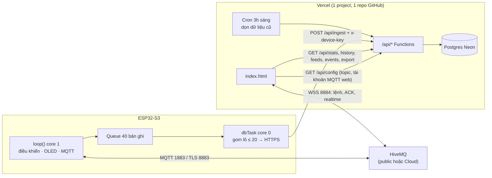
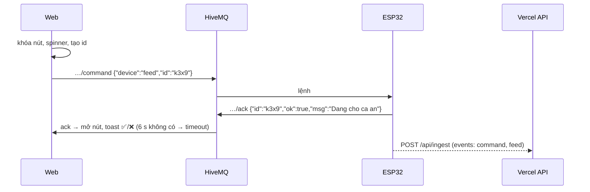

# 05 – WEB ↔ DATABASE ↔ ESP32 TRÊN VERCEL + HIVEMQ

> Firmware **v2.2.0** · Dashboard **v4** · Backend **Vercel Functions** · Database **Postgres (Neon, tạo trong Vercel)** · MQTT **HiveMQ** (public hoặc Cloud)
> Chỉ dùng **2 tài khoản**: Vercel (kèm Neon qua Marketplace) và HiveMQ. Không cần server riêng, không cần chạy SQL tay.

---

## 1. Kiến trúc



| Đường | Dùng cho | Tần suất |
|---|---|---|
| **HiveMQ (MQTT)** | Bấm nút, ACK, trạng thái realtime, biểu đồ *Live* | 2 s |
| **Vercel API → Postgres** | Biểu đồ 1h/6h/24h/7 ngày, KPI, cho ăn theo ngày, nhật ký, CSV | 1 bản ghi/phút + sự kiện |

### Luồng bấm nút (có xác nhận)


---

## 2. Cấu trúc code backend

```text
api/
├── ingest.js        POST  ESP32 ghi dữ liệu theo lô (header x-device-key)
├── history.js       GET   ?hours=  → điểm gom 1 phút / 10 phút / 1 giờ
├── stats.js         GET   ?hours=  → TB/min/max, % sò chạy, số lần ăn, cảnh báo
├── feeds.js         GET   ?days=   → số lần ăn/ngày (theo lịch / thủ công), giờ VN
├── events.js        GET   ?type=&limit=
├── export.js        GET   ?hours=  → file CSV
├── config.js        GET   cấu hình MQTT cho web (lấy từ Environment Variables)
├── health.js        GET   kiểm tra env + database
└── cron/cleanup.js  GET   Vercel Cron xóa dữ liệu cũ (cần CRON_SECRET)
lib/  db.js (pool pg + tự tạo bảng) · http.js · schema.js
db/   schema.sql (tham khảo – API tự chạy, không cần chạy tay)
```

**Bảo mật:** chỉ ai có `DEVICE_KEY` mới ghi được; tên cột được whitelist, giá trị kiểm tra kiểu/phạm vi, SQL dùng tham số `$1…` (chống SQL injection); thời gian lệch > 3 ngày bị thay bằng giờ server.

> **Đã kiểm thử** trên PostgreSQL 16 + giả lập Vercel: ghi sai/thiếu khóa → 401; body sai → 400; bản ghi rác bị loại (`rejected`); 865 bản ghi qua 15 lô; stats/history/feeds/events/export/cron/config trả đúng; web v4 chạy trong Chromium: KPI, biểu đồ 24h, nhật ký, lọc, CSV, ACK nút – không lỗi JS.

---

## 3. Triển khai từng bước

> ### ⚡ Cấu hình nhóm đang dùng: KHÔNG MẬT KHẨU (mặc định trong code)
> - Web mở trực tiếp `https://<app>.vercel.app`, không cần đăng nhập.
> - HiveMQ **public** (`broker.hivemq.com`), không user/pass.
> - API không cần `DEVICE_KEY`, không cần `CRON_SECRET`.
> - Firmware đã điền sẵn Wi-Fi `HO TRO SINH VIEN`.
>
> **Chỉ cần làm:** Bước 1 (push GitHub) → Bước 2 (Storage → Neon → Connect Project → Redeploy) → trong firmware sửa **`API_BASE_URL`** thành domain Vercel của nhóm → nạp code → mở `/api/health`.
> **Bỏ qua** Bước 3B và mọi biến ở Bước 4 trừ `DATABASE_URL` (Vercel tự thêm).
> Muốn bật bảo mật lại sau này: chỉ cần thêm biến `DEVICE_KEY` trên Vercel và điền cùng giá trị vào firmware.


### Bước 1 – Đưa code lên GitHub
Giải nén repo → trong thư mục `smart-aquarium-ai`:
```bash
git add .
git commit -m "W6: Vercel API + Postgres + HiveMQ, FW 2.2.0, dashboard v4"
git push
```
Vercel (đã nối repo từ trước) sẽ tự deploy. Thư mục `api/` được Vercel nhận thành Functions, `package.json` cài `pg` tự động.

### Bước 2 – Tạo database Postgres trong Vercel
1. Vercel → mở project → tab **Storage** → **Create Database** → chọn **Neon** (Postgres).
2. Region: **Singapore (ap-southeast-1)** → Create → **Connect Project** → tick Production/Preview/Development.
3. Vercel tự thêm biến `DATABASE_URL` (và `POSTGRES_URL`…) vào **Settings → Environment Variables**.
4. **Không cần chạy SQL**: lần gọi API đầu tiên sẽ tự tạo bảng `telemetry`, `events`.

### Bước 3 – Chọn HiveMQ

**(A) HiveMQ public** – nhanh, không cần tài khoản, ai biết topic cũng điều khiển được → **bắt buộc** đặt topic khó đoán.

**(B) HiveMQ Cloud (khuyên dùng khi demo)** – có mật khẩu:
1. https://console.hivemq.cloud → tạo cluster **Serverless (Free)**.
2. Tab **Overview**: ghi lại **Cluster URL** (`xxxxxxxx.s1.eu.hivemq.cloud`), port **8883** (TLS) và **8884** (WebSocket TLS).
3. Tab **Access Management** → tạo **2 tài khoản**:
   - `esp32` / mật khẩu mạnh – quyền **Publish and Subscribe** (dùng trong firmware).
   - `web` / mật khẩu khác – quyền **Publish and Subscribe** (dùng trên web; mật khẩu này trình duyệt nhìn thấy được, nên tách riêng để đổi khi cần).

### Bước 4 – Environment Variables trên Vercel
**Settings → Environment Variables** (Production), sau đó **Deployments → Redeploy**:

| Biến | Giá trị | Bắt buộc |
|---|---|---|
| `DATABASE_URL` | Vercel tự thêm ở Bước 2 | ✅ |
| `DEVICE_KEY` | chuỗi bí mật ≥ 16 ký tự, vd `aq-nhom05-7Hk2pQ9x` | ✅ |
| `CRON_SECRET` | chuỗi ngẫu nhiên bất kỳ (Vercel gửi kèm khi chạy cron) | ✅ |
| `MQTT_TOPIC_BASE` | `hcmute/esd/beca-nhom05-7hk2` (trùng firmware) | ✅ |
| `MQTT_WS_URL` | (A) `wss://broker.hivemq.com:8884/mqtt` · (B) `wss://xxxxxxxx.s1.eu.hivemq.cloud:8884/mqtt` | ✅ |
| `MQTT_WEB_USERNAME` / `MQTT_WEB_PASSWORD` | (A) để trống · (B) tài khoản `web` | (B) |
| `RETENTION_DAYS` | `30` | tùy chọn |

Kiểm tra: mở `https://<app>.vercel.app/api/health` → phải thấy `"ok": true` và các biến `true`.

### Bước 5 – Firmware
```cpp
// (A) HiveMQ public
const bool  MQTT_USE_TLS = false;
const char* MQTT_HOST    = "broker.hivemq.com";
const int   MQTT_PORT    = 1883;
const char* MQTT_USER    = "";
const char* MQTT_PASS    = "";

// (B) HiveMQ Cloud
const bool  MQTT_USE_TLS = true;
const char* MQTT_HOST    = "xxxxxxxx.s1.eu.hivemq.cloud";
const int   MQTT_PORT    = 8883;
const char* MQTT_USER    = "esp32";
const char* MQTT_PASS    = "mat-khau-esp32";

const char* TOPIC_BASE   = "hcmute/esd/beca-nhom05-7hk2";      // = MQTT_TOPIC_BASE
const char* API_BASE_URL = "https://smart-aquarium-ai.vercel.app"; // domain PRODUCTION
const char* DEVICE_KEY   = "aq-nhom05-7Hk2pQ9x";                // = DEVICE_KEY trên Vercel
```
⚠️ Dùng **domain Production** (`<tên>.vercel.app`). Link Preview (`…-git-…vercel.app`) thường bị *Deployment Protection* chặn → ESP32 nhận HTTP 401.

### Bước 6 – Kiểm tra toàn hệ thống
| # | Thao tác | Kỳ vọng |
|---|---|---|
| 1 | Serial Monitor sau khi nạp | Không có `[MQTT] Ket noi that bai`, không có `[DB] HTTP 401` |
| 2 | Mở web | 3 badge xanh: MQTT · Thiết bị online · Database OK |
| 3 | Đợi 2 phút → mở `/api/health` | `telemetry_rows` tăng |
| 4 | Bấm **CHO CÁ ĂN NGAY** | spinner → ✅ → servo chạy → nhật ký có `command` + `feed` |
| 5 | Bấm lại ngay | ❌ "Vua cho an < 60 s" |
| 6 | Rút điện ESP32, bấm **Sò lạnh** | sau 6 s ❌ "Thiết bị không phản hồi" |
| 7 | Tab **24 giờ**, **7 ngày** | biểu đồ min–max, % sò chạy, 2 đường ngưỡng |
| 8 | **Xuất CSV** | tải `aquarium_24h.csv`, mở Excel đúng tiếng Việt |
| 9 | Tắt router 5 phút rồi bật | sự kiện lúc mất mạng vẫn lên DB (≤ 40 bản ghi) |

---

## 4. Lỗi thường gặp

| Hiện tượng | Nguyên nhân / cách sửa |
|---|---|
| Serial `[MQTT] … state=4` hoặc `5` | Sai user/pass HiveMQ Cloud hoặc tài khoản thiếu quyền |
| Serial `[MQTT] … state=-2` | Sai host/port; Cloud phải `MQTT_USE_TLS=true` + port 8883 |
| Web badge `MQTT: sai tài khoản` | Sai `MQTT_WEB_USERNAME/PASSWORD` → sửa env → **Redeploy** |
| Serial `[DB] HTTP 401 Sai x-device-key` | `DEVICE_KEY` firmware ≠ Vercel, hoặc chưa Redeploy sau khi thêm biến |
| Serial `[DB] HTTP 401` trả về trang HTML | Đang dùng link Preview bị bảo vệ → dùng domain Production |
| Serial `[DB] HTTP 500 Thiếu biến môi trường DATABASE_URL` | Chưa Connect Project ở Bước 2 |
| Serial `[DB] HTTP -1` | Mất mạng/DNS, task tự thử lại |
| Web "Database: lỗi", `/api/health` báo lỗi | Xem thông báo `error` trong `/api/health` |
| Nút luôn timeout | `MQTT_TOPIC_BASE` ≠ `TOPIC_BASE` firmware, hoặc firmware cũ chưa có `/ack` |
| Mở `index.html` bằng double-click không có dữ liệu DB | Bình thường – API chỉ có trên Vercel. Muốn test local: đặt `CONFIG.API_BASE = "https://<app>.vercel.app"` |

## 5. Giới hạn gói miễn phí (kiểm tra lại trang giá khi nộp)
- **Vercel Hobby**: dành cho dự án cá nhân/phi thương mại; Cron chỉ chạy **1 lần/ngày** (đã cấu hình 20:00 UTC = 3:00 sáng VN).
- **Neon Free**: dung lượng nhỏ nhưng dư cho ~1 440 bản ghi/ngày; database tự "ngủ" khi không dùng, request đầu tiên sau đó chậm hơn vài giây.
- **HiveMQ Cloud Serverless Free**: đủ cho vài thiết bị + web của nhóm.

## 6. Mở rộng
- Cảnh báo Telegram khi `alarm`: trong `api/ingest.js`, nếu có event `alarm` → `fetch("https://api.telegram.org/bot<TOKEN>/sendMessage", …)` (lưu TOKEN trong env).
- Phân tích AI: thêm `api/insight.js` đọc `/api/history?hours=168` rồi gọi LLM tóm tắt xu hướng.
- Đăng nhập cho web: Vercel Deployment Protection (gói trả phí) hoặc tự thêm mật khẩu đơn giản ở `api/*`.

---
**Nguồn tham khảo:** [Vercel – Storage on Marketplace](https://vercel.com/docs/marketplace-storage) · [Neon – Vercel-Managed Integration](https://neon.com/docs/guides/vercel-managed-integration) · [HiveMQ Cloud Quick Start](https://docs.hivemq.com/hivemq-cloud/quick-start-guide.html) · [Vercel Cron – Usage & Pricing](https://vercel.com/docs/cron-jobs/usage-and-pricing) · [Vercel – Managing Cron Jobs](https://vercel.com/docs/cron-jobs/manage-cron-jobs)
